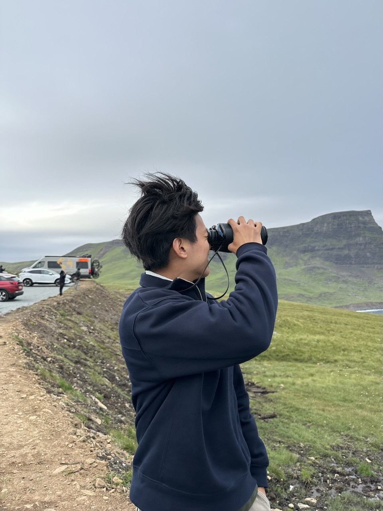

## Background

::: {.clearfix}

{.float-start .me-3 width="40%"}

I am a student in the MUSA program at Penn. I have a background in Geography and GIS in Planning, and I am interested in communicating geographical spatial analysis for public use.

I graduated from the University of Oxford with a BA Geography in 2026. During my undergraduate studies, I focused on both the theoretical concepts of human geography and the technical skills of quantitative GIS. As a part of my GIS module, I conducted network analysis to compute the accessibility index of the cycling network of Singapore. I intend to hone these skills further throughout the MUSA course in preparation for my work as an urban planner in Singapore.
:::

## Skills

<!-- CHANGE THIS: update this through the semester as it becomes true -->

- **Languages & Tools:** R, Quarto, Git
- **Spatial:** (add as you learn)
- **Data:** US Census / ACS via `tidycensus`

## Contact

<!-- CHANGE THIS -->

- Email: [isaactan@upenn.edu](mailto:isaactan@upenn.edu)
- GitHub: [@isaactanjy](https://github.com/isaactanjy)
